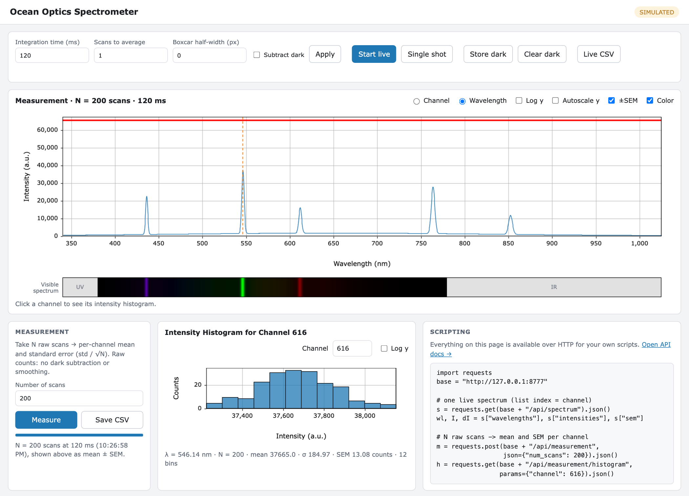

# Student guide: using the spectrometer dashboard

This guide is for students working with an Ocean Optics USB spectrometer (for example a
USB2000+) in the lab course. You need no programming to take and save spectra; if you
want to automate measurements, see [Scripting](#scripting-your-own-measurements).



## Starting and stopping

1. Double-click **SpectrometerDashboard.exe** on the lab PC (or the shortcut your
   instructor set up). A console window opens and your browser shows the dashboard at
   <http://127.0.0.1:8777/>.
2. The badge at the top right shows the spectrometer model and serial number. If it
   says **SIMULATED**, no spectrometer was found and you are looking at simulated
   data. A window then explains why and what to do (click the badge to open it
   again). Typical fixes: check the USB cable, close other programs that use the
   spectrometer (e.g. OceanView), then click **Retry hardware**. If it still does not
   work, click **Copy report** and send the text to your instructor.
3. To stop, close the console window. Closing only the browser tab leaves the app
   running; open <http://127.0.0.1:8777/> again to get back.

## The screen

### Controls (top bar)

| Control | What it does |
|---|---|
| Integration time (ms) | Exposure time of one scan. Longer means more signal, but watch for saturation. |
| Scans to average | Live view: average this many scans into each displayed spectrum. The grey band then shows the standard error of that mean. |
| Boxcar half-width (px) | Live view: smooth over ±N neighbouring channels (0 = off). |
| Apply | Sends the changed settings. Invalid settings are rejected with a red message and nothing changes. |
| Start live / Stop live | Continuous acquisition. |
| Single shot | Take one spectrum. |
| Example spectra… | Show a real spectrum recorded in the lab (see [Example spectra](#example-spectra)). |
| Store dark / Clear dark | Record or discard the dark spectrum. The label next to it shows whether one is stored. |
| Subtract dark | Subtract the stored dark spectrum, at once, in the live view and in measurements (see [Dark spectrum](#dark-spectrum)). Available once a dark spectrum is stored. |
| Live CSV | Save the current live spectrum as a CSV file. |

Messages appear below the controls: grey when a setting was applied, amber for a
warning, red when something was rejected, always with the reason.

### Spectrum plot

- The **blue line** is the (mean) intensity per channel in detector counts. Channels 0
  and 1 are hidden in the plot, following the lab's earlier analysis notebooks; they
  are still included in the CSV files.
- The **red line** is the saturation level of the 16-bit detector (2¹⁶ counts).
  If a peak touches it, the measurement at that wavelength is invalid: reduce the
  integration time.
- The **grey band** is ± one standard error of the mean (switch it off with *±SEM*).
  It is only visible when you average several scans and zoom in.
- **Channel / Wavelength** switches the horizontal axis between pixel number and
  calibrated wavelength. The label **λ calibration** above the plot says which
  calibration the wavelengths come from; a custom one is highlighted, and the axis then
  reads "custom calibration" (see [Wavelength calibration](#wavelength-calibration)).
- **Log y** uses a logarithmic intensity axis, useful for weak features next to strong
  lines.
- **Autoscale y** fits the vertical axis to the data you are looking at (otherwise it
  is fixed to 0 … 2¹⁶).
- **Zoom**: drag across the plot, or type the range into **x from … to** under the plot.
  **Reset zoom** (or a double-click) shows everything again. The zoom is kept while live
  data updates.
- **Click a channel** to select it (orange dashed line) and show its histogram.

### Visible-spectrum strip

The coloured strip under the plot shows roughly what the spectrum would look like to
the eye: each wavelength in its colour (CIE 1931 colour matching), brighter where the
intensity is higher. The brightest line in the current view sets full brightness, so
zooming in changes the strip. Wavelengths outside the visible range (below 380 nm or
above 780 nm) are shown grey and marked UV / IR. Switch it off with *Color*.

## Measurements with statistics

The live view is for aligning and looking. For data you want to analyse, use
**Measure**:

1. Set the integration time (and apply it).
2. Enter the **Number of scans** N (200 by default) and click **Measure**. A progress bar
   shows how far it is; it takes N × integration time.
3. The plot then shows the **mean** of the N scans per channel, with the **standard
   error of the mean** `SEM = σ / √N` as the grey band (σ = sample standard deviation
   of the N scans).
4. **Save CSV** stores channel, wavelength, mean and SEM for every channel.

Measurements are never smoothed. If **Subtract dark** is on, the mean is corrected by
the dark spectrum and the SEM includes the dark spectrum's uncertainty (the two add in
quadrature); the CSV file then also contains the raw values and the dark spectrum. The
histograms always show the raw counts of the detector.

### Histogram of one channel

After a measurement, click any channel in the plot (or type its number) to see the
**distribution of its N readings**, with mean, standard deviation σ and SEM. Try:

- Compare a channel on a strong line with one on the dark background: how do σ and
  the shape of the distribution differ?
- The variance σ² of a channel grows with its mean signal (shot noise). Plotting σ²
  against the mean for many channels lets you estimate the detector's gain and read
  noise.
- Watch what happens to a channel that is saturated.

## Dark spectrum

The dark spectrum is what the detector reads without light (electronic offset and dark
current). To subtract it:

1. Set the integration time you will measure with, and set *Scans to average* to 10 or
   more, so the dark spectrum itself is not too noisy.
2. Block the light path (cap the fibre, or switch off the source) and click
   **Store dark**. The label next to it now shows "dark: … ms".
3. Unblock the light and tick **Subtract dark**. It acts at once, in the live view and
   in measurements; the plot title then says "dark subtracted".

A dark spectrum only fits the integration time it was taken at. If you change the
integration time, it is discarded automatically, subtraction switches off, and an
amber message asks you to store a new one.

The dark level is typically a few hundred to about two thousand counts, so on the full
0 … 2¹⁶ scale the difference is hard to see: switch on **Autoscale y** or **Log y** to
see it.

## Wavelength calibration

The spectrometer converts each channel p to a wavelength with a polynomial
λ(p) = c0 + c1·p + c2·p² + c3·p³ stored in the device (the *factory calibration*). It
can drift or be inaccurate; you can check and replace it with lines of known
wavelength, for example from a mercury lamp (404.656, 435.833, 546.074, 576.960 and
579.066 nm).

1. Record the lamp spectrum (live or as a measurement) and click **λ calibration** above
   the plot. The calibration panel opens next to the plot.
2. Click a peak in the spectrum, then **Add selected peak**: the panel takes the
   centre of that peak, with sub-channel precision. Enter the line's known wavelength.
   Repeat for lines spread over the whole range.
3. The table compares both calibrations for every line: where it falls under the
   factory calibration and under the custom one, each with its deviation Δ from the
   known wavelength, plus the RMS deviation.
4. **Fit lines and use** fits the polynomial (order: number of lines − 1, at most 3, or
   choose it) and uses it for all wavelengths, plots and CSV files. Alternatively, type
   coefficients and click **Use these coefficients**.

A custom calibration is saved for this spectrometer (by serial number) and used again
next time; the label above the plot is then highlighted. **Back to factory
calibration** returns to the values stored in the device. Beyond the outermost lines a
fit is an extrapolation: the panel shows the largest difference between the two
calibrations across the detector.

## Example spectra

**Example spectra…** in the top bar shows real spectra recorded in the lab with a
USB2000+: spectral lamps (mercury, cadmium, helium-neon, sodium), sunlight with its
Fraunhofer lines, a candle, a smartphone screen, a desk lamp and the absorption bands
of iodine. They work without a spectrometer; a blue note above the plot marks them as
examples. Live view, **Single shot** or **Measure** return to your own data.

Examples contain the mean and SEM of the original measurement, so there are no
histograms. With an example on screen, the calibration panel is a **practice mode**:
fit the known lines of the mercury or cadmium lamp and compare the result with the
calibration the spectrum was recorded with, without changing your own spectrometer's
calibration. In the mercury example the blue lines come out about 0.2–0.3 nm too high.

## Limits you may run into

- Live averaging is limited to 30 s per spectrum (scans × integration time). For longer
  runs, set *Scans to average* to 1 and use **Measure**.
- A measurement can have up to 5000 scans and last up to 30 minutes.
- Only one measurement runs at a time. While it runs, the other controls are locked.

The full list is in the [API reference](api.md#limits).

## Scripting your own measurements

Everything on the page is also available over HTTP. The *Scripting* box on the page
shows a starting point; the link *Open API docs* leads to an interactive reference where
you can try every request. A minimal Python script:

```python
import requests
import matplotlib.pyplot as plt

base = "http://127.0.0.1:8777"
requests.post(f"{base}/api/config", json={"integration_time_ms": 100}).raise_for_status()
m = requests.post(f"{base}/api/measurement", json={"num_scans": 100}).json()

plt.errorbar(m["wavelengths"], m["mean"], yerr=m["sem"], fmt="-", ecolor="gray")
plt.xlabel("Wavelength (nm)")
plt.ylabel("Intensity (counts)")
plt.show()
```

See the [API reference](api.md) for all endpoints and
[`examples/student_client.py`](../spectro-dashboard/examples/student_client.py) for a
complete example with a histogram.
